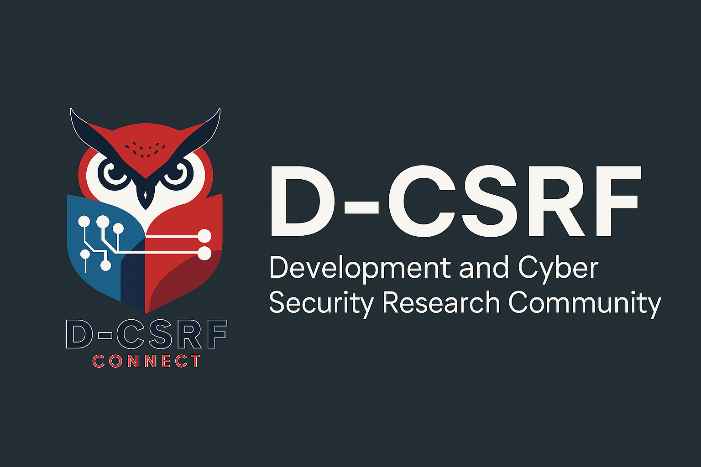

  

# 🛡️ D-CSRF Connect

### 👤 Tentang Saya  
**Nama:** Haidir Mirza Ahmad Zacky  
**NIM:** 23552011072  
**Kelas:** TIF RP 23 CNS B  

---

**D-CSRF Connect** adalah aplikasi Android komunitas yang dirancang untuk memfasilitasi komunikasi dan pembelajaran bagi para anggota dalam bidang **Development** dan **Cyber Security**. Aplikasi ini dikembangkan sebagai studi kasus UTS *Mobile Programming 1* di Universitas Teknologi Bandung.

---

### 🚀 Fitur Utama

- 💬 **Login & Register**  
  Sistem autentikasi lokal menggunakan `SharedPreferences`.

- 🗣️ **List Chat**  
  Menampilkan daftar percakapan antar anggota serta grup komunitas seperti Red Team, Blue Team, Dev Team, CTF Squad, dll.

- 📚 **Materi Edukasi**  
  Menyediakan daftar materi belajar seputar topik pengembangan perangkat lunak dan keamanan siber.

- 🎨 **Desain Clean & Modern**  
  Tampilan berbasis Material Design dengan warna dominan merah (#D32F2F) yang konsisten dan profesional.

- ☰ **Toolbar Menu**  
  Navigasi mudah ke halaman "Materi" dan opsi logout melalui menu titik tiga di pojok kanan atas.

---

### 🧱 Teknologi yang Digunakan

- Android Studio (Native)
- Kotlin + XML

---

### Authentication Screens

| Splash Screen | Login | Register |
|---------------|--------|-----------|
|  |  |  |

### Main Features

| List Chat | Materi |
|-----------|--------|
|  |  |

---

### 📝 Laporan Proyek

Dokumen laporan lengkap mengenai pengembangan aplikasi ini tersedia dalam format PDF:

📄 **[Laporan PDF](https://github.com/jck-cysec/UTS-PM1-HaidirZacky/blob/main/docs/UTS%20PM1%20-%20HaidirMirzaAhmadZacky%20-%2023552011072.pdf)**

---

### 👨‍💻 Kontributor

- Haidir Zacky — Infromatics Engineer  
- Universitas Teknologi Bandung — *UTS Mobile Programming 1*
